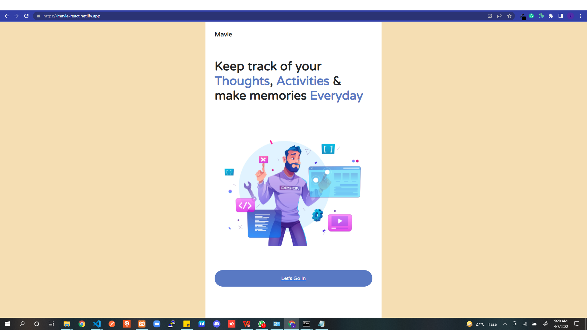

# Mavie

This is a Progressive Web Application (PWA) that let's a person keep track of their thoughts, activities & record memories daily

  

## Main Features

<ul>
  <li>Notes section to keep track of daily thoughts and activities</li>
  <li>Weight section to keep track of daily weight fluctuations</li>
  <li>Memory section to keep record of daily memories (Upload images and remnder descriptions)</li>
  <li>Progressive Web App</li>
</ul>

## Frontend Tools

<ul>
  <li>React</li>
  <li>Redux</li>
  <li>React Hooks</li>
  <li>Bootstrap</li>
</ul>

## Backend Tools
[The Backend Repo](https://github.com/joshBeals/mavie_backend).
<ul>
  <li>Node.js</li>
  <li>Express</li>
  <li>MongoDB</li>
  <li>Cloudinary</li>
</ul>

